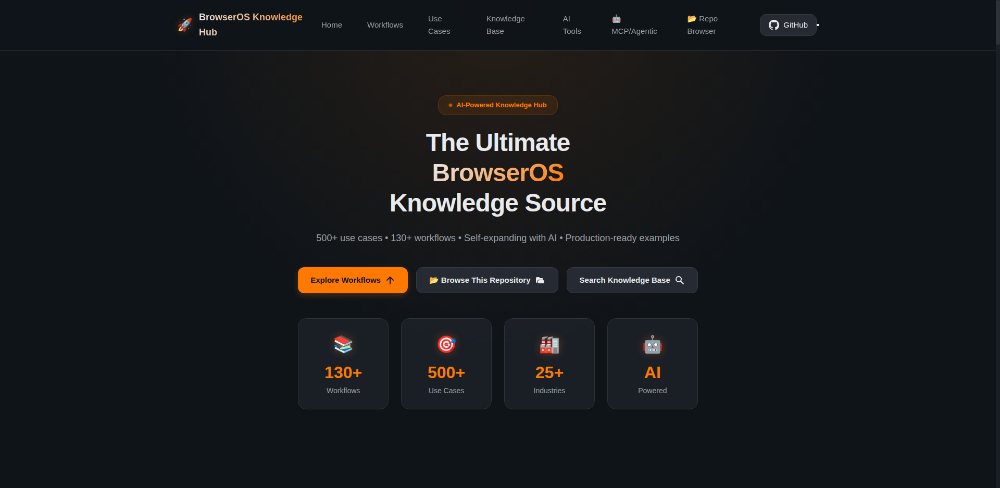
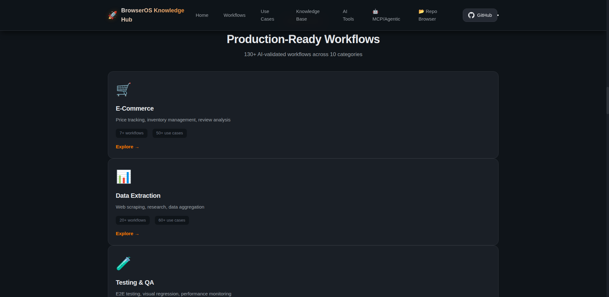
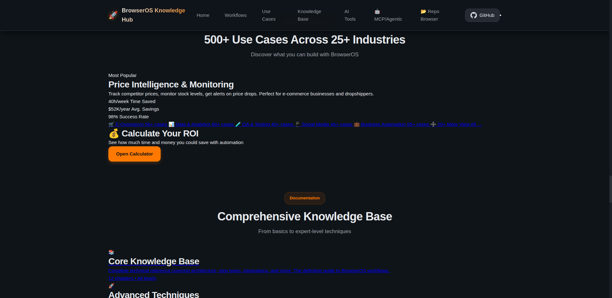
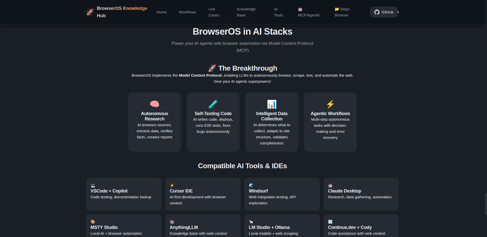
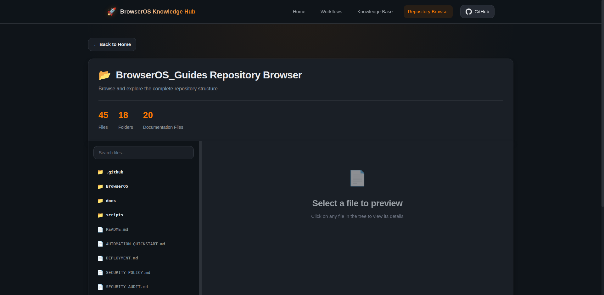
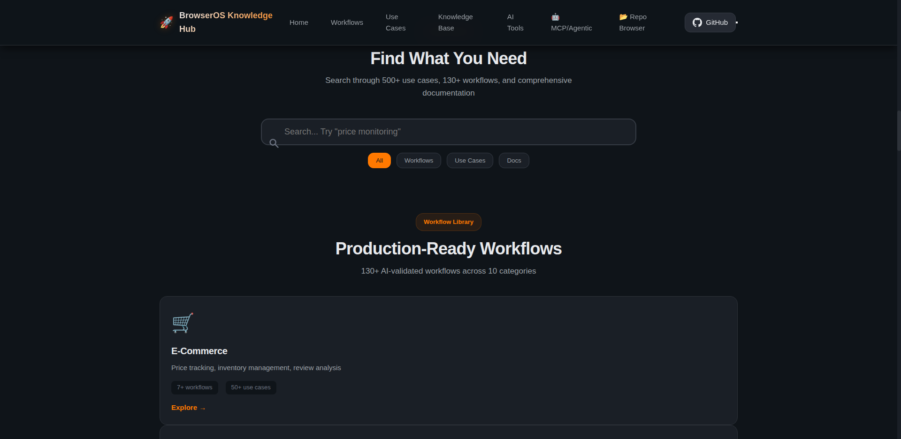

# 🚀 BrowserOS Workflows Knowledge Base

> **A self-aware intelligence layer for BrowserOS agents**  
> Self-maintaining, AI-powered, with HTTP MCP server for immediate agent integration

<div align="center">

## 🌟 New: HTTP MCP Server Integration

**Connect this knowledge base to BrowserOS in 30 seconds via "Add Custom App"**

```bash
npm run mcp-server
# Server starts at http://localhost:3100/mcp
```

**📖 [Quick Start Guide](./QUICKSTART_MCP.md)** | **🏗️ [Architecture](./ARCHITECTURE.md)** | **📡 [MCP Integration](./build-docs/02-implementation/MCP_SERVER_INTEGRATION.md)**

[](/.github/workflows/update-kb.yml)
[](https://www.python.org/)
[](https://nodejs.org/)
[](LICENSE)

</div>

---

## ✨ What's New in v2.0

This repository has evolved into an **operational intelligence layer** for BrowserOS agents:

- 🧠 **HTTP MCP Server** - 10 tools for agent self-awareness
- 📚 **917+ Executable Workflows** - Ready-to-use, validated templates
- 🔐 **Content Integrity** - SHA-256 hashing with delta detection
- ⚠️ **Anti-Patterns Catalog** - Know what fails before trying
- ✅ **Ground Truth Validation** - Verified against BrowserOS source code
- 🔄 **Event-Driven Updates** - Real-time sync with BrowserOS repo
- 🌐 **Universal MCP** - Works with BrowserOS, Claude Desktop, Cursor, etc.

### How to Use

**Option 1: MCP Server (Recommended for BrowserOS)**
```bash
npm run mcp-server
# Add to BrowserOS: http://localhost:3100/mcp
```

**Option 2: Interactive Website**
```bash
# Open docs/index.html or deploy to GitHub Pages
```

**Option 3: Direct Library Import**
```javascript
import templates from './library/templates'
```

---

## 🌐 Live Website (Setup Required)

**Interactive knowledge hub with 917+ workflows, 500+ use cases, and AI-powered tools**

> ⚠️ **GitHub Pages Setup Required**: To make the live site available at [https://grumpified-oggvct.github.io/BrowserOS_Guides/](https://grumpified-oggvct.github.io/BrowserOS_Guides/), you need to:
> 1. **Merge this PR** to main/master branch
> 2. **Enable GitHub Pages**: Go to Settings → Pages → Source: "GitHub Actions"
> 3. The deployment workflow will automatically publish the site

---

## 📸 Website Preview

<div align="center">

### **Interactive Knowledge Hub**
<picture>
  <source srcset="docs/screenshots/01-hero-section.webp" type="image/webp">
  
</picture>

*The static website in `docs/` includes the full interactive knowledge hub with 917+ workflows and 500+ use cases*

</div>

---

## 🙏 Acknowledgments & Credit

### **BrowserOS Team** - The Amazing Builders! 🌟

This repository exists to document and celebrate the **incredible work** of the [BrowserOS team](https://github.com/browseros-ai) who built this groundbreaking browser automation platform.

**🎉 HUGE CREDIT to the BrowserOS team for:**
- 🏗️ Building an innovative browser automation platform
- 📚 Creating comprehensive workflow capabilities
- 🤖 Enabling AI-powered web interactions
- 🌐 Open-sourcing their amazing work
- 💡 Pioneering the future of browser-based automation

**Official BrowserOS Resources:**
- 🔗 **GitHub**: [browseros-ai/BrowserOS](https://github.com/browseros-ai/BrowserOS)
- 📖 **Documentation**: [docs.browseros.com](https://docs.browseros.com)
- 💬 **Community**: Join discussions on HackerNews and GitHub

This knowledge base is a **community contribution** that aggregates and organizes information about BrowserOS Workflows to help developers learn and build with this powerful platform.

---

## 📖 What Is This Repository?

This is a **living, self-maintaining knowledge base** that:

✅ **Automatically researches** BrowserOS Workflows from multiple sources  
✅ **Uses AI** (Ollama + OpenRouter) to synthesize information intelligently  
✅ **Updates weekly** with the latest features, patterns, and best practices  
✅ **Self-validates** to ensure completeness and accuracy  
✅ **Tracks changes** with version tagging (kb-YYYY.MM.DD)

### The Problem We're Solving

**Challenge**: Keeping up with BrowserOS's rapid development  
**Solution**: Automated AI-powered knowledge compilation from official sources

---

## 🎨 Website Features (in `docs/` Directory)

### 📚 130+ Workflows Organized by Category

<div align="center">

<picture>
  <source srcset="docs/screenshots/02-workflows-section.webp" type="image/webp">
  
</picture>

*E-Commerce, Data Extraction, Testing & QA, Social Media, Research, CRM, Content Creation, API Integration, and more!*

</div>

### 🎯 500+ Use Cases Across Industries

<div align="center">

<picture>
  <source srcset="docs/screenshots/03-use-cases-section.webp" type="image/webp">
  
</picture>

*Real-world examples from retail, healthcare, finance, logistics, marketing, customer service, and beyond*

</div>

### 🤖 MCP & Agentic AI Integration

<div align="center">

<picture>
  <source srcset="docs/screenshots/04-mcp-agentic-section.webp" type="image/webp">
  
</picture>

*Use BrowserOS with VSCode, Cursor, Windsurf, Claude Desktop, MSTY, AnythingLLM, and 10+ AI tools*

</div>

### 📂 Interactive Repository Browser

<div align="center">

<picture>
  <source srcset="docs/screenshots/05-repo-browser.webp" type="image/webp">
  
</picture>

*Browse the entire repository structure, search files, preview content, and navigate with ease*

</div>

### 🔍 Powerful Search Functionality

<div align="center">

<picture>
  <source srcset="docs/screenshots/06-search-section.webp" type="image/webp">
  
</picture>

*AI-powered search across 500+ use cases, 130+ workflows, and comprehensive documentation*

</div>

---

## 🎯 Why This Exists

### Use Cases

#### 1. **For Developers Building with BrowserOS**
- 📚 Comprehensive reference for all workflow capabilities
- 🔍 Searchable documentation of 14+ step types
- 💡 Real-world patterns and examples
- ⚡ Always up-to-date with latest features

#### 2. **For Teams Evaluating BrowserOS**
- 📊 Complete capability overview
- 🔒 Security and compliance information
- 💰 Resource limits and constraints
- 🏢 Enterprise features documentation

#### 3. **For AI Agents & LLM Context**
- 🤖 Structured knowledge base for RAG systems
- 📝 Complete schema definitions
- 🔗 Cross-referenced information
- ✅ Validated and fact-checked content

#### 4. **For Learning & Onboarding**
- 🎓 Step-by-step workflow creation guides
- 🎯 Best practices and patterns
- 🔐 Security guidelines
- 📈 Migration paths and version history

---

## 🤖 How It Works - The Automation Magic

### Weekly Automated Updates (GitHub Actions)

```
┌─────────────────────────────────────────────────────────┐
│ 🕐 SUNDAY 00:00 UTC - Automated Research Begins         │
└──────────────────┬──────────────────────────────────────┘
                   │
┌──────────────────▼──────────────────────────────────────┐
│ 1️⃣  CLONE OFFICIAL REPOS                                │
│    • browseros-ai/BrowserOS (latest)                    │
│    • browser-use/workflow-use                           │
└──────────────────┬──────────────────────────────────────┘
                   │
┌──────────────────▼──────────────────────────────────────┐
│ 2️⃣  FETCH WEB SOURCES                                   │
│    • Documentation sites                                 │
│    • GitHub issues & PRs                                 │
│    • Community discussions                               │
│    • Technical specifications                            │
└──────────────────┬──────────────────────────────────────┘
                   │
┌──────────────────▼──────────────────────────────────────┐
│ 3️⃣  AI-POWERED ANALYSIS                                 │
│    🧠 Ollama API: Local LLM processing                  │
│    🤖 OpenRouter: Claude/GPT-4 synthesis                │
│    → Extract insights, changes, patterns                │
└──────────────────┬──────────────────────────────────────┘
                   │
┌──────────────────▼──────────────────────────────────────┐
│ 4️⃣  SYNTHESIZE & UPDATE KB                              │
│    • Generate "Latest Updates" section                   │
│    • Add new features discovered                         │
│    • Update examples and patterns                        │
└──────────────────┬──────────────────────────────────────┘
                   │
┌──────────────────▼──────────────────────────────────────┐
│ 5️⃣  VALIDATE COMPLETENESS                               │
│    ✅ All 12 sections present (C01)                     │
│    ✅ No placeholders (C02)                             │
│    ✅ Valid sources (C03)                               │
│    ✅ Checksum tracking (C05)                           │
└──────────────────┬──────────────────────────────────────┘
                   │
┌──────────────────▼──────────────────────────────────────┐
│ 6️⃣  AUTO-COMMIT & TAG                                   │
│    📝 Commit: "🤖 Automated KB update - YYYY-MM-DD"     │
│    🏷️  Tag: kb-YYYY.MM.DD                               │
│    🚀 Push to main branch                               │
└─────────────────────────────────────────────────────────┘
```

### Powered By

- **🤖 Ollama Cloud Service** - Local LLM processing for analysis
- **🧠 OpenRouter** - Access to Claude, GPT-4, and other frontier models
- **⚡ GitHub Actions** - Automated weekly execution
- **🐍 Python** - Research pipeline and validation scripts

---

## 📚 What's Inside the Knowledge Base?

### Comprehensive Coverage (12 Major Sections)

1. **📋 Overview & Scope** - What BrowserOS Workflows can do
2. **🏗️ Architecture Diagram** - Visual system architecture
3. **🔧 Step Types Catalog** - All 14+ step types with examples
4. **🔄 Execution Flow Control** - Loops, branching, parallel execution
5. **🎯 Trigger & Integration Matrix** - How workflows start and connect
6. **📐 Configuration Schema** - Complete JSON Schema reference
7. **🚀 Advanced Features** - CodeAgent, Cowork, enterprise capabilities
8. **⚠️ Limitations & Constraints** - Resource limits, performance
9. **🔒 Security Best Practices** - Secrets, validation, XSS prevention
10. **💡 Community Patterns** - Real-world use cases and examples
11. **📈 Migration & Version History** - Upgrade paths and changelogs
12. **📖 Appendices** - Glossary, acronyms, FAQ, license

### Key Capabilities Documented

#### Workflow Step Types (14+)
- `navigate` - URL navigation
- `click` - Element interaction
- `input` - Form filling
- `extract` - Data scraping
- `wait` - Conditional pausing
- `conditional` - If/then/else logic
- `loop` - Iteration (foreach, while, repeat)
- `parallel` - Concurrent execution
- `screenshot` - Page capture
- `execute_code` - Python CodeAgent
- `read_file` / `write_file` - Cowork integration
- `shell` - Command execution
- `api_call` - HTTP requests
- `sub_workflow` - Workflow composition

#### Advanced Features
- **🐍 Python CodeAgent** - Execute Python in workflows (pandas, numpy, requests)
- **📁 Cowork Integration** - Local file system access
- **🔄 Self-Healing** - AI-powered element detection on failure
- **⚡ Parallel Execution** - Multiple operations simultaneously
- **🔐 Secrets Management** - Secure API key handling
- **🎛️ Lifecycle Hooks** - Custom logic at workflow boundaries

---

## 🚀 Quick Start

### 🌍 Cross-Platform Installation (Windows, macOS, Linux)

**Universal installation system with auto-update:**

#### 🪟 Windows
```batch
git clone https://github.com/Grumpified-OGGVCT/BrowserOS_Guides.git
cd BrowserOS_Guides
install.bat          # Install dependencies & launch wizard
run.bat              # Run the system
```

#### 🍎 macOS / 🐧 Linux
```bash
git clone https://github.com/Grumpified-OGGVCT/BrowserOS_Guides.git
cd BrowserOS_Guides
chmod +x install.sh run.sh
./install.sh         # Install dependencies & launch wizard
./run.sh             # Run the system
```

**Features:**
- ✅ **Universal Installation** - Works on Windows, macOS, Linux
- ✅ **Interactive Setup Wizard** - Guides through ALL configuration
- ✅ **Auto-Update System** - Checks and installs updates on startup (bulletproof!)
- ✅ **Configuration Manager** - Modify settings anytime
- ✅ **Main Menu** - All operations in one place
- ✅ **Cross-Platform** - Same functionality everywhere

📖 **Guides**:
- [CROSS_PLATFORM_SETUP.md](CROSS_PLATFORM_SETUP.md) - Universal guide for all platforms
- [WINDOWS_SETUP.md](WINDOWS_SETUP.md) - Windows-specific details

---

### 🌐 View the Interactive Website

The website exists in the `docs/` directory and can be viewed:

#### Option 1: View Locally (Works Now)
```bash
# Clone the repository
git clone https://github.com/Grumpified-OGGVCT/BrowserOS_Guides.git
cd BrowserOS_Guides

# Start a local web server
python3 -m http.server 8000 --directory docs

# Open in browser: http://localhost:8000
```

#### Option 2: Via GitHub Pages (Requires Setup)
To enable the live GitHub Pages site at `https://grumpified-oggvct.github.io/BrowserOS_Guides/`:

1. **Merge this PR** to main/master branch
2. **Enable GitHub Pages**:
   - Go to: Settings → Pages
   - Source: Select "GitHub Actions"
   - Save
3. **Deployment is automatic** - The workflow in `.github/workflows/deploy-pages.yml` will deploy on every push to main

### 📖 Access the Knowledge Base Content

**Three ways to explore:**

1. **📂 Interactive Website** *(in `docs/` folder)*
   - Full website with navigation
   - Real-time search
   - Repository browser
   - View locally or deploy to GitHub Pages

2. **📂 Repository Browser**: Open `docs/repo-browser.html` locally
   - Navigate folder structure
   - Search across all files
   - Preview markdown content

3. **📄 Direct KB**: [BrowserOS/Research/BrowserOS_Workflows_KnowledgeBase.md](BrowserOS/Research/BrowserOS_Workflows_KnowledgeBase.md)
   - Complete knowledge base markdown
   - Downloadable for offline use

### For Maintainers: Enable Automation

#### 1. Add API Keys (GitHub Secrets)

**Settings → Secrets and variables → Actions → New repository secret**

| Secret Name | Where to Get It | Purpose |
|-------------|-----------------|---------|
| `OLLAMA_API_KEY` | https://ollama.ai/keys | LLM processing |
| `OPENROUTER_API_KEY` | https://openrouter.ai/keys | Enhanced AI research |

#### 2. Enable GitHub Actions

- **Settings → Actions → General**
- Workflow permissions: "Read and write"
- ✅ Allow GitHub Actions to create and approve pull requests

#### 3. Test It!

- Go to **Actions** tab
- Select **"Update BrowserOS Knowledge Base"**
- Click **"Run workflow"**
- Monitor progress and verify results

📖 **Detailed Setup**: [AUTOMATION_QUICKSTART.md](AUTOMATION_QUICKSTART.md) (5-minute guide)

---

## 📁 Repository Structure

```
BrowserOS_Guides/
│
├── 📖 README.md (this file)
├── 🚀 AUTOMATION_QUICKSTART.md       # 5-minute setup guide
├── 📋 LICENSE                         # MIT License
│
├── 🗂️ BrowserOS/                     # Knowledge Base Directory
│   ├── structure.md                   # Primary index
│   ├── README.md                      # KB usage guide
│   └── Research/
│       ├── BrowserOS_Workflows_KnowledgeBase.md (⭐ MAIN KB)
│       ├── sources.json               # 12 research sources
│       ├── verify_kb_completeness.ps1 # PowerShell validation
│       └── raw/                       # Archived sources (gitignored)
│
├── ⚙️ .github/
│   ├── workflows/
│   │   └── update-kb.yml              # GitHub Actions automation
│   └── ACTIONS_SETUP.md               # Detailed automation docs
│
├── 🐍 scripts/
│   ├── research_pipeline.py           # AI-powered research engine
│   ├── validate_kb.py                 # KB validation (C01-C05)
│   ├── setup_wizard.py                # Interactive first-run configuration (cross-platform)
│   ├── config_manager.py              # Post-setup configuration tool (cross-platform)
│   ├── auto_update.py                 # Bulletproof auto-update system (cross-platform)
│   ├── workflow_generator.py          # AI-powered workflow creation
│   ├── self_test.py                   # Comprehensive system tests
│   └── security_scanner.py            # Security vulnerability scanner
│
├── 🪟 install.bat                     # Windows installation script
├── 🪟 run.bat                         # Windows main execution menu
├── 🐧 install.sh                      # Unix installation script (macOS/Linux)
├── 🐧 run.sh                          # Unix main execution menu (macOS/Linux)
├── 📦 requirements.txt                # Python dependencies
├── 🔧 config.yml                      # Universal configuration
├── 📝 .env.template                   # Environment variables template
├── 🔧 update_kb.ps1                   # PowerShell automation script
└── 🙈 .gitignore                      # Comprehensive exclusions
```

---

## 🧪 Local Development & Testing

### Prerequisites

```bash
# Python 3.11+ required
python --version

# Install dependencies
pip install -r requirements.txt
```

### Test Validation

```bash
# Run KB validation (C01-C05 checks)
python scripts/validate_kb.py
```

### Test Research Pipeline

```bash
# Set API keys
export OLLAMA_API_KEY="your-ollama-key"
export OPENROUTER_API_KEY="your-openrouter-key"

# Run research pipeline
python scripts/research_pipeline.py
```

### PowerShell Automation (Windows)

```powershell
# Dry run (no commits)
.\update_kb.ps1 -DryRun

# Full update
.\update_kb.ps1
```

---

## 💰 Cost & Sustainability

### API Costs (Estimated)

**Weekly automated runs:**
- **Ollama API**: ~2K-4K tokens/run = **$1-5/month**
- **OpenRouter API**: ~4K tokens/run = **$0.50-2/month**

**Total**: ~**$1.50-7/month** for fully automated, always-current KB

This is **far cheaper** than manual documentation maintenance and ensures the KB is always up-to-date with BrowserOS's rapid development.

---

## 🎯 Validation & Quality Assurance

Every KB update must pass **6 validation checks**:

- ✅ **C01**: All 12 required sections present
- ✅ **C02**: No placeholder markers (TODO, TBD, FIXME)
- ✅ **C03**: Valid sources.json with complete metadata
- ✅ **C04**: YAML/JSON schema validation
- ✅ **C05**: Checksum stability tracking
- ✅ **C06**: Git repository cleanliness and proper tagging

---

## 🤝 Contributing

We welcome contributions to improve the knowledge base!

### How to Contribute

1. **Improve Documentation**
   - Add new examples
   - Clarify existing content
   - Fix inaccuracies

2. **Enhance Automation**
   - Improve AI prompts
   - Add new sources to `sources.json`
   - Optimize research pipeline

3. **Report Issues**
   - Documentation gaps
   - Automation failures
   - Validation errors

### Contribution Process

1. Fork the repository
2. Create a feature branch
3. Test your changes locally
4. Submit a PR with clear description
5. Pass validation checks

---

## 📅 Update Schedule

- **🤖 Automated**: Every Sunday at 00:00 UTC
- **👤 Manual**: Via GitHub Actions UI (workflow_dispatch)
- **🏷️ Versioning**: Tagged as `kb-YYYY.MM.DD`

**Next scheduled update**: Check the [Actions tab](https://github.com/Grumpified-OGGVCT/BrowserOS_Guides/actions) for countdown

---

## 🔗 Official BrowserOS Resources

### Primary Sources

- **🏠 Homepage**: [browseros.com](https://browseros.com)
- **📚 Documentation**: [docs.browseros.com](https://docs.browseros.com)
- **💻 GitHub**: [github.com/browseros-ai/BrowserOS](https://github.com/browseros-ai/BrowserOS) ⭐
- **🔧 workflow-use**: [github.com/browser-use/workflow-use](https://github.com/browser-use/workflow-use)
- **📖 Browser Use Docs**: [docs.browser-use.com](https://docs.browser-use.com)

### This Repository's Resources

- **📂 Interactive Website**: Available in `docs/` directory (view locally or deploy to GitHub Pages)
- **📂 Repository Browser**: `docs/repo-browser.html` (view locally)
- **💻 GitHub Repo**: [github.com/Grumpified-OGGVCT/BrowserOS_Guides](https://github.com/Grumpified-OGGVCT/BrowserOS_Guides)

### Community

- **💬 Discussions**: [GitHub Discussions](https://github.com/browseros-ai/BrowserOS/discussions)
- **🐛 Issues**: [GitHub Issues](https://github.com/browseros-ai/BrowserOS/issues)
- **📢 HackerNews**: Community feedback and use cases

---

## ❓ FAQ

### Q: How do I view the interactive website?
**A**: The website files are in the `docs/` directory. You can:
- **View locally now**: Run `python3 -m http.server 8000 --directory docs` and open http://localhost:8000
- **Deploy to GitHub Pages**: Merge this PR, then enable GitHub Pages in Settings → Pages → Source: "GitHub Actions"

The website includes searchable workflows, use cases, repository browser, and comprehensive documentation.

### Q: Why isn't the GitHub Pages link working?
**A**: GitHub Pages requires setup:
1. This PR needs to be merged to main branch
2. GitHub Pages needs to be enabled in repository settings (Settings → Pages → Source: "GitHub Actions")
3. Once enabled, the deployment workflow will automatically publish the site at https://grumpified-oggvct.github.io/BrowserOS_Guides/

### Q: Why automate this?
**A**: BrowserOS is rapidly evolving. Automated compilation ensures the KB stays current without manual effort, capturing new features as they're released.

### Q: Why use AI?
**A**: AI (Ollama + OpenRouter) intelligently synthesizes information from multiple sources, identifies patterns, and presents insights in a structured format.

### Q: Is this official documentation?
**A**: No, this is a **community-maintained** knowledge base. Always refer to [official BrowserOS docs](https://docs.browseros.com) for authoritative information. We aggregate and organize that information for easier consumption.

### Q: Can I contribute?
**A**: Absolutely! See the Contributing section above. We welcome improvements, examples, and corrections.

### Q: How accurate is the KB?
**A**: We use official sources and validate all updates (C01-C06 checks). However, always verify critical information with [official docs](https://github.com/browseros-ai/BrowserOS).

### Q: What if APIs fail?
**A**: The system gracefully degrades - it can still fetch and archive sources without AI synthesis. Manual review can then be performed.

---

## 📜 License

**MIT License** - See [LICENSE](LICENSE) file

This repository is independently maintained and is not officially affiliated with BrowserOS. We're just huge fans documenting their amazing work! 🎉

---

## 🌟 Star History

If this knowledge base helps you, please star the repo! ⭐

It helps others discover this resource and shows appreciation for the automation work.

---

## 🔄 Workflow Automation Status

This repository uses GitHub Actions to automate maintenance and updates:

| Workflow | Status | Purpose | Trigger |
|----------|--------|---------|---------|
| 📚 Update KB | ⚡ Ready | Syncs with official BrowserOS repo, generates workflows | Weekly Sun 00:00 UTC + Manual |
| 🧪 Self-Test | ⚡ Ready | Runs 42 tests, security scans, auto-fixes issues | Weekly Sun 02:00 UTC + Manual |
| 🚀 Deploy Pages | ✅ Active | Deploys website to GitHub Pages | On push + Manual |
| 🎯 Trigger All | ⚡ Ready | Convenience workflow to trigger others | Manual only |

**Quick Actions**:
- 📋 [View All Workflows](https://github.com/Grumpified-OGGVCT/BrowserOS_Guides/actions)
- 🚀 [Trigger Workflows](.github/workflows/README.md#-how-to-trigger-workflows)
- 📊 [Workflow Documentation](.github/workflows/README.md)
- 🔍 [Verification Report](build-docs/05-final-verification/WORKFLOW_VERIFICATION_REPORT.md)

**For Detailed Workflow Information**:
- [Workflow Trigger Guide](WORKFLOW_TRIGGER_GUIDE.md) - Comprehensive guide to triggering and monitoring workflows
- [Workflow Verification Report](build-docs/05-final-verification/WORKFLOW_VERIFICATION_REPORT.md) - Testing and verification status

---

## 📞 Support & Contact

- **📖 Full Documentation**: [AUTOMATION_QUICKSTART.md](AUTOMATION_QUICKSTART.md)
- **🔧 Automation Details**: [.github/ACTIONS_SETUP.md](.github/ACTIONS_SETUP.md)
- **🔄 Workflow Guide**: [WORKFLOW_TRIGGER_GUIDE.md](WORKFLOW_TRIGGER_GUIDE.md)
- **🐛 Issues**: [GitHub Issues](https://github.com/Grumpified-OGGVCT/BrowserOS_Guides/issues)
- **💡 Discussions**: [GitHub Discussions](https://github.com/Grumpified-OGGVCT/BrowserOS_Guides/discussions)

---

<div align="center">

**Built with ❤️ by the community**  
**Celebrating the incredible work of the BrowserOS team 🎉**

### 📂 Interactive Website in `docs/` Directory

View locally: `python3 -m http.server 8000 --directory docs`  
Deploy to Pages: Merge PR + enable in Settings → Pages

[⭐ Star this repo](https://github.com/Grumpified-OGGVCT/BrowserOS_Guides/stargazers) • [🔀 Fork it](https://github.com/Grumpified-OGGVCT/BrowserOS_Guides/fork) • [📖 Read the KB](BrowserOS/Research/BrowserOS_Workflows_KnowledgeBase.md)

</div>
