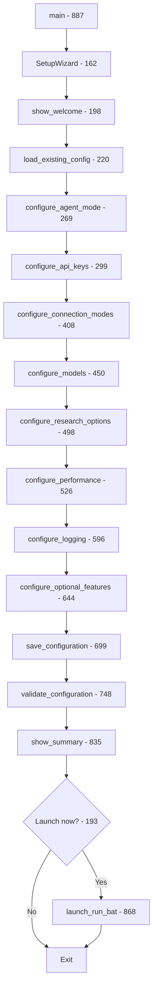

# Setup Wizard - Immaculate Structural Map & Flow Documentation

**Purpose:** Crystal-clear documentation for future renovations, ensuring surgical modifications without section confusion.

---

## 📋 Table of Contents

1. [File Sections & Line Ranges](#file-sections--line-ranges)
2. [Complete Flow Diagram](#complete-flow-diagram)
3. [Configuration Options Matrix](#configuration-options-matrix)
4. [Helper Functions Reference](#helper-functions-reference)
5. [Menu Choices & Triggers](#menu-choices--triggers)
6. [Dependency Graph](#dependency-graph)
7. [Surgical Modification Guide](#surgical-modification-guide)

---

## 1. File Sections & Line Ranges

| Section | Lines | Purpose | Key Elements |
|---------|-------|---------|-------------|
| **Imports & Setup** | 1-35 | Dependencies, Colors class, subprocess imports | os, sys, subprocess, dotenv, resilience utils |
| **UI Helper Functions** | 37-115 | Display formatting, input collection | 10 functions (clear_screen, print_*, get_*, yes_no) |
| **Validation Function** | 117-139 | `validate_api_key_format()` | Regex pattern, length check, logging |
| **Package Test Function** | 141-160 | `test_python_imports()` | Tests 7 packages (requests, dotenv, yaml, etc.) |
| **SetupWizard Class Init** | 162-167 | Class initialization | self.config dict, logger setup |
| **Main Run Method** | 169-196 | Orchestrates entire wizard flow | Calls all 10 configure methods in sequence |
| **Welcome Section** | 198-218 | `show_welcome()` | Displays ASCII art, waits for Enter |
| **Load Config Section** | 220-267 | `load_existing_config()` | Reads .env, parses KEY=VALUE lines, handles errors |
| **Step 1: Agent Mode** | 269-297 | `configure_agent_mode()` | 6 mode choices (hybrid, sdk, http, mcp, local, docker) |
| **Step 2: API Keys** | 299-406 | `configure_api_keys()` | Ollama, OpenRouter, GitHub tokens |
| **Step 3: Connection Modes** | 408-448 | `configure_connection_modes()` | Ollama mode (5 opts), OpenRouter mode (3 opts) |
| **Step 4: Model Selection** | 450-496 | `configure_models()` | Swarm toggle, primary + 2 fallbacks |
| **Step 5: Research Pipeline** | 498-524 | `configure_research_options()` | Force update, GitHub repos/issues, web sources |
| **Step 6: Performance** | 526-594 | `configure_performance()` | Workers (1-20), timeout (30-300s), cache (1-30d) |
| **Step 7: Logging** | 596-642 | `configure_logging()` | Log level, metrics toggle, metrics port |
| **Step 8: Optional Features** | 644-697 | `configure_optional_features()` | Auto-update, Docker, encryption |
| **Save Config** | 699-746 | `save_configuration()` | Creates .env backup, writes config dict |
| **Validate Config** | 748-833 | `validate_configuration()` | Checks models, ports, timeouts, keys, dependencies |
| **Show Summary** | 835-866 | `show_summary()` | Displays final configuration table |
| **Launch System** | 868-885 | `launch_run_bat()` | Starts run.bat on Windows, run.sh on Unix |
| **Main Entry Point** | 887-908 | `main()` | Exception handling wrapper, calls SetupWizard().run() |

---

## 2. Complete Flow Diagram



**Linear Path:**
```
main() → SetupWizard() → show_welcome() → load_existing_config() → 
configure_agent_mode() → configure_api_keys() → configure_connection_modes() → 
configure_models() → configure_research_options() → configure_performance() → 
configure_logging() → configure_optional_features() → save_configuration() → 
validate_configuration() → show_summary() → [Launch?] → launch_run_bat() / Exit
```

---

## 3. Configuration Options Matrix

| Config Key | Type | Valid Values | Validation | Lines | Default | Notes |
|-----------|------|--------------|------------|-------|---------|-------|
| **AGENT_MODE** | string | hybrid, sdk, http, mcp, local, docker | Enum check | 284, 296 | hybrid | Core connection strategy |
| **OLLAMA_API_KEY** | string | 20+ chars, alphanumeric + `-/_.` | Regex + length | 128-139, 323-346 | empty | Optional for local Ollama |
| **OPENROUTER_API_KEY** | string | 20+ chars, alphanumeric + `-/_.` | Regex + length | 128-139, 349-376 | empty | Required for cloud models |
| **GITHUB_TOKEN** | string | 20+ chars, alphanumeric + `-/_.` | Regex + length | 128-139, 379-406 | empty | Required for repo tracking |
| **OLLAMA_MODE** | string | http, sdk, mcp, docker, local | Enum check | 423, 433 | http | How to connect to Ollama |
| **OPENROUTER_MODE** | string | http, sdk, mcp | Enum check | 436, 446 | http | How to connect to OpenRouter |
| **USE_SWARM** | bool | "true", "false" | Boolean check | 468 | true | Enable agent swarm mode |
| **PRIMARY_MODEL** | string | Non-empty or "swarm" | Non-empty | 471, 477, 756-758 | swarm | Main model for generation |
| **FALLBACK_MODEL_1** | string | Non-empty | Warn if empty | 483, 760-762 | deepseek-v3.2:cloud | First fallback |
| **FALLBACK_MODEL_2** | string | Non-empty | Non-empty | 489 | anthropic/claude-3-sonnet | Second fallback |
| **FORCE_UPDATE** | bool | "true", "false" | Boolean check | 509 | false | Regenerate KB unconditionally |
| **FETCH_GITHUB_REPOS** | bool | "true", "false" | Boolean check | 514 | true | Clone and analyze repos |
| **FETCH_GITHUB_ISSUES** | bool | "true", "false" | Boolean check | 518 | true | Fetch issue discussions |
| **FETCH_WEB_SOURCES** | bool | "true", "false" | Boolean check | 522 | true | Scrape web documentation |
| **MAX_WORKERS** | int | 1-20 | Range check | 540-546 | 5 | Parallel request workers |
| **REQUEST_TIMEOUT** | int | 30-300 seconds | Range + > 0 | 560-567, 774-779 | 60 | Network request timeout |
| **CACHE_DURATION** | int | 1-30 days | Range check | 580-587 | 7 | How long to cache data |
| **LOG_LEVEL** | string | DEBUG, INFO, WARNING, ERROR, CRITICAL | Enum check | 605-613 | INFO | Python logging level |
| **ENABLE_METRICS** | bool | "true", "false" | Boolean check | 618 | false | Prometheus metrics |
| **METRICS_PORT** | int | 1-65535 | Port range | 626-635, 765-771 | 9090 | Metrics server port |
| **AUTO_UPDATE_MODE** | string | auto, prompt, disabled | Enum check | 655-668 | auto | KB auto-regeneration |
| **COMPOSE_PROJECT_NAME** | string | Docker-valid name | Non-empty if Docker | 681-683 | browseros-kb | Docker Compose project |
| **ENCRYPTION_KEY** | string | Min 32 chars | Length if enabled | 691-693 | empty | Secret encryption key |

---

## 4. Helper Functions Reference

| Function | Lines | Signature | Returns | Purpose | Usage Count |
|----------|-------|-----------|---------|---------|-------------|
| `clear_screen()` | 37-46 | `() -> None` | None | Cross-platform screen clear | 8x (before each step) |
| `print_header()` | 48-52 | `(text: str) -> None` | None | 80-char bordered header | 10x (section titles) |
| `print_section()` | 54-58 | `(text: str) -> None` | None | Blue section divider | 15x (subsections) |
| `print_success()` | 60-62 | `(text: str) -> None` | None | Green ✓ success message | 5x (confirmations) |
| `print_error()` | 64-66 | `(text: str) -> None` | None | Red ✗ error message | 12x (validation failures) |
| `print_warning()` | 68-70 | `(text: str) -> None` | None | Yellow ⚠ warning message | 8x (non-critical issues) |
| `print_info()` | 72-74 | `(text: str) -> None` | None | Cyan ℹ info message | 20+ (explanations) |
| `get_input()` | 76-81 | `(prompt: str, default: str) -> str` | str | User text input with default | 10x (text fields) |
| `get_choice()` | 83-102 | `(prompt: str, options: list, default: int) -> int` | int | Menu choice (0-indexed) | 7x (menus) |
| `yes_no()` | 104-115 | `(prompt: str, default: bool) -> bool` | bool | Y/n prompt → boolean | 12x (toggles) |
| `validate_api_key_format()` | 117-139 | `(key: str, provider: str) -> bool` | bool | Regex + length validation | 3x (API keys) |
| `test_python_imports()` | 141-160 | `() -> Dict[str, bool]` | dict | Check installed packages | 1x (validation step) |

**Helper Function Dependencies:**
- `clear_screen()` → subprocess (platform-specific `cls` or `clear`)
- `get_choice()` → `get_input()` internally
- `validate_api_key_format()` → regex pattern matching
- `test_python_imports()` → importlib.import_module()

---

## 5. Menu Choices & Triggers

### Step 1: Agent Mode (Line 292-294)
```python
Options: ["Hybrid", "SDK", "HTTP", "MCP", "Local", "Docker"]
Maps to: AGENT_MODE = ["hybrid", "sdk", "http", "mcp", "local", "docker"]
Default: 0 (Hybrid)
```

### Step 3a: Ollama Mode (Line 430-432)
```python
Options: ["HTTP", "SDK", "MCP", "Docker", "Local"]
Maps to: OLLAMA_MODE = ["http", "sdk", "mcp", "docker", "local"]
Default: 0 (HTTP)
```

### Step 3b: OpenRouter Mode (Line 443-445)
```python
Options: ["HTTP", "SDK", "MCP"]
Maps to: OPENROUTER_MODE = ["http", "sdk", "mcp"]
Default: 0 (HTTP)
```

### Step 4a: Swarm Toggle (Line 466-467)
```python
yes_no("Enable Swarm Mode?", default=True)
  → USE_SWARM = "true" / "false"
  → If true: PRIMARY_MODEL = "swarm"
```

### Step 7a: Log Level (Line 612)
```python
Options: ["DEBUG", "INFO", "WARNING", "ERROR", "CRITICAL"]
Maps to: LOG_LEVEL = selected option
Default: 1 (INFO)
```

### Step 8a: Auto-Update Mode (Line 667)
```python
Options: ["AUTO", "PROMPT", "DISABLED"]
Maps to: AUTO_UPDATE_MODE = ["auto", "prompt", "disabled"]
Default: 0 (AUTO)
```

### All Yes/No Toggles:
| Line | Prompt | Config Key | Default |
|------|--------|-----------|---------|
| 466 | Enable Swarm Mode? | USE_SWARM | True |
| 508 | Force update KB? | FORCE_UPDATE | False |
| 513 | Fetch GitHub repos? | FETCH_GITHUB_REPOS | True |
| 517 | Fetch GitHub issues? | FETCH_GITHUB_ISSUES | True |
| 521 | Fetch web sources? | FETCH_WEB_SOURCES | True |
| 617 | Enable metrics? | ENABLE_METRICS | False |
| 678 | Use Docker? | (sets COMPOSE_PROJECT_NAME) | No |
| 688 | Enable encryption? | (prompts for ENCRYPTION_KEY) | No |
| 193 | Launch run.bat now? | (calls launch_run_bat) | Yes |

---

## 6. Dependency Graph

```
┌─────────────────────────────────────────────────────────────────┐
│ Step 1: Agent Mode [269]                                        │
│   AGENT_MODE = hybrid/sdk/http/mcp/local/docker                 │
│   • Determines which connection methods are available           │
└────────────────────┬────────────────────────────────────────────┘
                     ↓
┌─────────────────────────────────────────────────────────────────┐
│ Step 2: API Keys [299]                                          │
│   • OLLAMA_API_KEY [323-346]                                    │
│   • OPENROUTER_API_KEY [349-376]                                │
│   • GITHUB_TOKEN [379-406]                                      │
│   → Each validated with validate_api_key_format()               │
└────────────────────┬────────────────────────────────────────────┘
                     ↓
┌─────────────────────────────────────────────────────────────────┐
│ Step 3: Connection Modes [408]                                  │
│   • OLLAMA_MODE [423-433]       (requires OLLAMA_API_KEY)       │
│   • OPENROUTER_MODE [436-446]   (requires OPENROUTER_API_KEY)   │
└────────────────────┬────────────────────────────────────────────┘
                     ↓
┌─────────────────────────────────────────────────────────────────┐
│ Step 4: Model Selection [450]                                   │
│   • USE_SWARM [466-468]                                         │
│   • PRIMARY_MODEL [471-477]     (swarm if USE_SWARM=true)       │
│   • FALLBACK_MODEL_1 [481-484]                                  │
│   • FALLBACK_MODEL_2 [487-490]                                  │
│   → OLLAMA_MODEL = PRIMARY_MODEL [493]                          │
│   → OPENROUTER_MODEL = FALLBACK_MODEL_2 [494]                   │
└────────────────────┬────────────────────────────────────────────┘
                     ↓
┌─────────────────────────────────────────────────────────────────┐
│ Step 5: Research Pipeline [498]                                 │
│   • FORCE_UPDATE [508]          (triggers KB regeneration)      │
│   • FETCH_GITHUB_REPOS [513]    (requires GITHUB_TOKEN)         │
│   • FETCH_GITHUB_ISSUES [517]   (requires GITHUB_TOKEN)         │
│   • FETCH_WEB_SOURCES [521]     (independent)                   │
└────────────────────┬────────────────────────────────────────────┘
                     ↓
┌─────────────────────────────────────────────────────────────────┐
│ Step 6: Performance [526]                                       │
│   • MAX_WORKERS [535-546]       (1-20, affects parallelism)     │
│   • REQUEST_TIMEOUT [555-572]   (30-300s, affects reliability)  │
│   • CACHE_DURATION [575-592]    (1-30d, affects freshness)      │
└────────────────────┬────────────────────────────────────────────┘
                     ↓
┌─────────────────────────────────────────────────────────────────┐
│ Step 7: Logging [596]                                           │
│   • LOG_LEVEL [605-613]                                         │
│   • ENABLE_METRICS [616-618]                                    │
│   • METRICS_PORT [621-640]      (only if ENABLE_METRICS=true)   │
└────────────────────┬────────────────────────────────────────────┘
                     ↓
┌─────────────────────────────────────────────────────────────────┐
│ Step 8: Optional Features [644]                                 │
│   • AUTO_UPDATE_MODE [655-668]  (auto/prompt/disabled)          │
│   • COMPOSE_PROJECT_NAME [674-683] (if Docker enabled)          │
│   • ENCRYPTION_KEY [688-695]    (min 32 chars if enabled)       │
└────────────────────┬────────────────────────────────────────────┘
                     ↓
┌─────────────────────────────────────────────────────────────────┐
│ Save Configuration [699]                                        │
│   • Backup existing .env [705-710]                              │
│   • Write all config keys [721-734]                             │
└────────────────────┬────────────────────────────────────────────┘
                     ↓
┌─────────────────────────────────────────────────────────────────┐
│ Validate Configuration [748]                                    │
│   • PRIMARY_MODEL non-empty [756-758]                           │
│   • FALLBACK_MODEL_1 warning [760-762]                          │
│   • METRICS_PORT valid [765-771]                                │
│   • REQUEST_TIMEOUT > 0 [774-779]                               │
│   • API key warnings [782-789]                                  │
│   • Check dependencies [793-806]                                │
└────────────────────┬────────────────────────────────────────────┘
                     ↓
┌─────────────────────────────────────────────────────────────────┐
│ Show Summary [835] → Launch Option [193]                        │
└─────────────────────────────────────────────────────────────────┘
```

**Critical Dependencies:**
- Step 3 depends on Step 2 (needs API keys)
- Step 5 (GitHub options) depends on Step 2 (GITHUB_TOKEN)
- Step 7 (METRICS_PORT) conditional on ENABLE_METRICS
- Step 8 (ENCRYPTION_KEY) conditional on encryption toggle

---

## 7. Surgical Modification Guide

### 🔧 Adding a New Configuration Option

**Location:** Insert in Step 8 (Optional Features) at line ~695

```python
# Example: Add ENABLE_TELEMETRY option
telemetry = yes_no("Enable usage telemetry?", default=False)
self.config["ENABLE_TELEMETRY"] = "true" if telemetry else "false"
```

**Then add validation** at line ~830:
```python
# Validate telemetry
if self.config.get("ENABLE_TELEMETRY") == "true":
    logger.info("✓ Telemetry enabled - data will be collected")
```

**And update summary** at line ~865:
```python
print(f"  Telemetry:          {self.config.get('ENABLE_TELEMETRY', 'false')}")
```

---

### 🔧 Adding a New Validation Rule

**Location:** `validate_configuration()` method, lines 748-833

```python
# Example: Validate cache duration is reasonable
cache_days = int(self.config.get("CACHE_DURATION", "7"))
if cache_days > 14:
    print_warning(f"⚠ Cache duration {cache_days} days is very long")
    print_info("  Consider reducing to avoid stale data")
```

---

### 🔧 Changing Step Order

**Location:** `run()` method, lines 178-185

```python
# Current order:
self.configure_agent_mode()
self.configure_api_keys()
self.configure_connection_modes()
# ...

# To swap Steps 4 and 5:
self.configure_agent_mode()
self.configure_api_keys()
self.configure_connection_modes()
self.configure_research_options()  # ← Moved up
self.configure_models()             # ← Moved down
self.configure_performance()
# ...
```

⚠️ **Warning:** Check dependencies! Some steps require data from previous steps.

---

### 🔧 Adding a New Menu

**Location:** Any `configure_*` method

```python
def configure_new_feature(self):
    """Configure new feature"""
    clear_screen()
    print_header("Step X: New Feature Configuration")
    print_section("Choose Your Option")
    
    # Add numbered menu
    options = ["Option A", "Option B", "Option C"]
    choice = get_choice(
        "Select configuration mode:",
        options,
        default=0
    )
    
    # Store result
    selected = ["mode_a", "mode_b", "mode_c"][choice]
    self.config["NEW_FEATURE_MODE"] = selected
    print_success(f"✓ Set NEW_FEATURE_MODE to {selected}")
```

**Then call it** in `run()` method at line ~185.

---

### 🔧 Modifying Helper Function

**Location:** Lines 37-115

**Example:** Add color to `get_input()` prompt:
```python
def get_input(prompt: str, default: str = "") -> str:
    """Get input from user with optional default"""
    if default:
        prompt_text = f"{Colors.CYAN}{prompt} [{default}]{Colors.RESET}: "
    else:
        prompt_text = f"{Colors.CYAN}{prompt}{Colors.RESET}: "
    # ... rest of function
```

---

### 🔧 Changing Default Values

**Two locations to update:**

1. **In configure method** (e.g., line 546):
```python
workers = int(get_input("Max workers:", default="10"))  # Changed from "5"
```

2. **In config.get()** (e.g., line 540):
```python
current = self.config.get("MAX_WORKERS", "10")  # Changed from "5"
```

---

## 🚨 Critical Sections (Modify with Extreme Care)

| Section | Lines | Why Critical | Impact of Bugs |
|---------|-------|--------------|----------------|
| **save_configuration()** | 699-746 | Writes .env file | Could corrupt config, lose all settings |
| **load_existing_config()** | 220-267 | Parses .env file | Could fail to load existing config |
| **validate_configuration()** | 748-833 | Dependency checker | Could allow invalid configs to pass |
| **main() exception handler** | 887-908 | Top-level error handling | Unhandled exceptions crash wizard |
| **launch_run_bat()** | 868-885 | Starts main system | Could fail to launch or pass wrong args |

---

## 📝 Version History

| Date | Version | Changes | Author |
|------|---------|---------|--------|
| 2026-02-13 | 1.0 | Initial immaculate map created | Copilot Agent |

---

## 🔗 Related Documentation

- `AUTOMATION_HARDENING_PLAN.md` - Overall hardening strategy
- `scripts/utils/resilience.py` - Utility functions used throughout wizard
- `.env.template` - Configuration file format reference
- `README.md` - User-facing setup instructions

---

**Last Updated:** 2026-02-13  
**Maintainer:** BrowserOS Team  
**Status:** Production-Ready ✅
